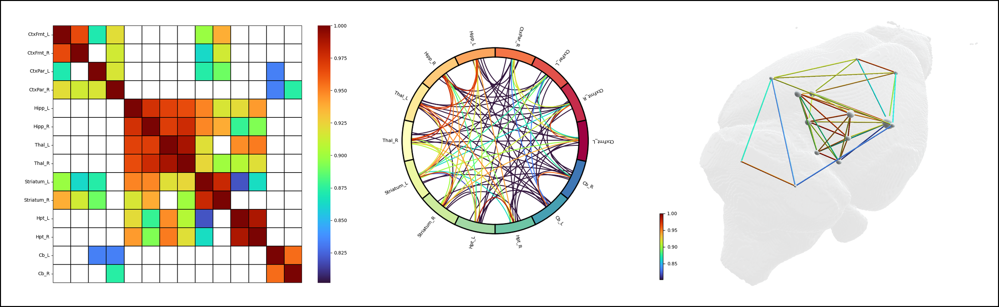

# PyMBN: Python Multiple-Sampling Brain Networks 🧠

[](https://www.python.org/downloads/release/python-3100/)

PyMBN is a Python implementation of the Multiple Sampling (MS) scheme for constructing stable Metabolic Brain Networks, as proposed in our [research paper](https://doi.org/10.1162/netn.a.23).


## 🚀 Features

- Multiple Sampling scheme implementation for stable network construction
- Graph theoretical measures computation [WIP]
- Network visualization tools
- Statistical analysis utilities




## 🔧 Installation

1. **Set up Environment** (requires [micromamba](https://mamba.readthedocs.io/en/latest/installation/micromamba-installation.html))
```bash
# Create and activate environment
micromamba create -n pymbn python=3.10 pip -c conda-forge
micromamba activate pymbn

# Install dependencies
pip install -r requirements.txt
```

2. **Install System Dependencies** (Ubuntu/Debian)
```bash
sudo apt-get install python3-tk libgl1 libegl1 libgomp1
```

## 💻 Usage

1. **Activate Environment**
```bash
micromamba activate pymbn
```

2. **Run Analysis**
```bash
python main.py
```

Parameters (alpha, theta, number of samples, sampling type, representative criterion, etc.) are set in `ManualSetup` in `src/ui_parser.py`.

Results will be available in the `results/` and `outputs/` directories.

3. **Run Tests** (optional)
```bash
pip install pytest
pytest
```


## 📖 Methods
For detailed methodology, please refer to our paper: [Stable brain PET metabolic networks using a multiple sampling scheme](https://doi.org/10.1162/netn.a.23)

## 📬 Contact
Guilherme Schu - guischu09@gmail.com
